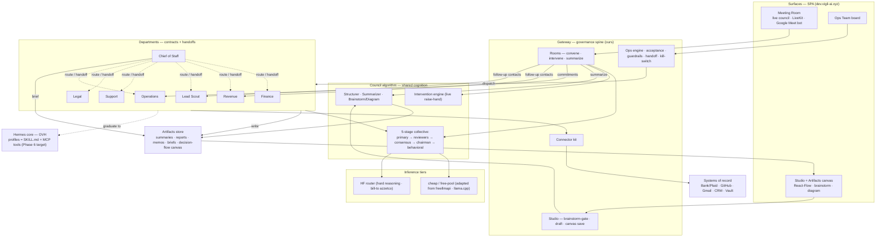
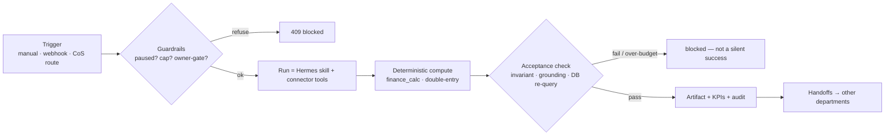

# Agentic Company — Master Plan

Status: **living plan**. Last updated 2026-06-22. Supersedes the direction in
`plans/ops-team-agentic-company.md` (which remains the P0–P2 build record).

A company of department agents running **inside the Hermes project we built** —
governed by our own thin spine, powered by Hermes-core skills + tools, and grown by
**adapting open-source engineering into our own code**, never by depending on it.

---

## 0. Governing principles (the constraints, in priority order)

1. **Add to Hermes core, don't build another layer.** Capability lives as Hermes
   **skills** (`SKILL.md`) + **MCP tools** + our **gateway compute**. We do not adopt a
   second agent framework/runtime (AutoGen, MetaGPT, CrewAI, n8n-as-a-service, …).
2. **Mimic the engineering — no vendor/client relationship with a repo.** We clone a
   source only to *read* it, then **reimplement/adapt** the engineering in our stack.
   We never run someone's app/agent/proxy and depend on it at runtime.
3. **Keep the governance spine.** The one thing no OSS agent has: deterministic
   **acceptance**, multi-tenant **scoping**, the **owner gate**, the **handoff ledger**,
   the **kill switch**. That stays in our gateway. Capability moves to skills/tools;
   the spine dispatches and grades them.
4. **Numbers are computed, not guessed.** Where math matters (finance), compute it
   deterministically; the model only narrates. Acceptance = an arithmetic invariant.
5. **System-of-record access is fine; 3rd-party agents are not.** Reaching the
   company's own data (bank, GitHub, inbox) via *our own* connector is necessary.
   Depending on an experimental agent/proxy repo is the thing we avoid.

---

## 0a. Commercial reality — this is multi-tenant SaaS

This is a **product sold to companies**, not the owner's internal tool. Each customer
is a **tenant** running *their own* company of agents. This is a governing constraint;
several recommendations above change because of it.

- **Tenant isolation (already true — keep absolute):** every table is `user_id`/tenant
  -scoped via RLS + the gateway scope-guard; departments, connections, artifacts, and
  secrets all seed and scope per tenant.
- **Platform vs tenant credentials (correction):** connector *app* credentials (Plaid
  `client_id/secret`; OAuth app keys for GitHub/Gmail/HubSpot) are **ours — one set in a
  secrets manager**, not per-customer and not the per-user "keys-from-UI" (that is for our
  operator/admin config only). A tenant authorizes via **OAuth / Plaid-Link** → a per-tenant
  **access token** (encrypted, least-privilege scopes).
- **Inference tier (correction):** **free LLM tiers must NOT serve paying tenants** (ToS
  prohibit commercial resale; rate-limited/unreliable). The freellmapi engineering is for
  *internal* tooling only. Customer-serving cheap tier = **self-hosted llama.cpp on our
  infra** or a **paid** cheap model; hard reasoning = HF/paid. Cost is metered per tenant.
- **Autonomy default (correction to §0/earlier):** acting autonomously on a *customer's*
  money/email/contracts is a liability surface. Commercial default = **approval-gated for
  irreversible/outbound actions, configurable per tenant/plan**. We already have the
  owner-gate + acceptance + kill-switch to support either mode.
- **Cost · metering · plan gating (new):** per-tenant usage metering (council cost is
  already tracked per call) → **billing**; spend caps and which departments/connectors are
  enabled become **plan-derived**, not hardcoded.
- **Scaling (new risk):** "departments → per-tenant Hermes profiles on one OVH box" does
  **not** scale to N tenants × M departments. The governed **gateway** (stateless,
  horizontally scalable) stays the runtime; Hermes core provides **pooled** skills/tools.
  Phase 6 is reframed accordingly (skills/tools pooled, not per-tenant OVH profiles).
- **Onboarding / self-serve (new):** sign-up → provision tenant departments (per-user
  seeding exists) → **OAuth connect** each system of record → run. No operator pasting keys
  per customer.
- **Compliance & security (new, now blocking):** GDPR data export/deletion, encryption
  at rest (RLS + Fernet present), **secret rotation** (secrets exposed in dev chat are a
  commercial blocker — rotate before launch), least-privilege connector scopes, and a
  SOC2 trajectory for selling to businesses. Connectors hold tenants' bank/email tokens —
  the highest-value attack surface; treat accordingly.

---

## 1. How the ecosystem works inside Hermes

The company is a **closed loop**: meetings produce structured artifacts + commitments
+ contacts → those feed the departments → departments act and produce more artifacts →
the Chief of Staff briefs → back into the next meeting. The **council algorithm** is the
shared cognition used by *both* the Meeting Room and the departments; the **Artifacts
store** is the shared work-product surface; the **connector kit** reaches the systems of
record.

### 1a. The systems and how they connect

- **Meeting Room** (`/v1/rooms`) — the live surface. Invite advisors (council lenses),
  capture the transcript (typed, LiveKit room, or the Google Meet bot bridge), **convene
  the council** (the 5-stage algorithm streamed over the transcript), get **live
  interventions** ("raise hand" on a heartbeat), then **summarize → artifact + decision-
  flow canvas + commitments + follow-up contacts**.
- **Council algorithm** (`winny/council/*`) — the shared brain, *not* a single model
  call: the **5-stage collective** (primary specialist → parallel reviewers → weighted
  consensus → chairman synthesis iff consensus fails → behavioral overlay → verdict), the
  **intervention engine** (specialist fan-out → judge → behavioral overlay → should-speak),
  and **structurer / summarizer / brainstorm-diagram** lenses. The inference **tiers** sit
  *under* it (cheap/free-pool for routine, HF for hard). Both meetings and departments call
  this same cognition.
- **Studio / Artifacts** (`/v1/artifacts`) — the shared work-product surface. **Every**
  output is an `artifacts` row: meeting summaries, Finance reports, Legal memos, CoS
  briefs, brainstorming boards. The **React-Flow canvas** (CanvasWorkspace + VigilNode)
  edits them, with the council **brainstorm** (lenses) and **diagram** panels, versioned
  on save.
- **The handoffs between them (the systematic work):** a meeting's **commitments** flow to
  **Operations** (digest/track); its **follow-up contacts** flow to **Revenue + Lead
  Scout**; its **artifact** opens in **Studio**. Department runs **write artifacts** and
  call the **same council algorithm**; the **Chief of Staff** routes departments and emits
  the **company brief** (an artifact) — which seeds the next meeting. That is the loop.

### The governed run loop (every department run)

---

## 2. Departments (the roster)

| Dept | Head | Jobs | Acceptance (what "worked" means) | System of record |
|---|---|---|---|---|
| **Finance** (CFO) | cfo_review | reconcile · report | category sums reconcile to net; txns categorised | Bank (Plaid) → ledger |
| **Revenue** | cro | follow_up | a draft per stalled deal (review-then-send) | CRM |
| **Lead Scout** | cro | scout | leads created + qualified, handed to Revenue | inbox → CRM |
| **Support** | comms | triage | every msg triaged w/ valid category; drafts for `respond` | Mail |
| **Legal** | legal_review | review | cites **real** Vault docs (grounded) | Vault docs |
| **Operations** | coo | digest | digest counts re-reconcile (deterministic) | commitments · tasks |
| **Chief of Staff** | cos | route · brief | dispatched N departments / brief compiled | all (orchestrates) |

Each is an effectiveness contract: **job · input · tools · output · acceptance · budget**.
A department is "live" only after its `selftest` passes.

---

## 3. Capability layers (where each piece lives)

- **Brain — council (tiered):** cheap/free-pool tier for high-volume classification
  (our router, engineering adapted from freellmapi; or self-hosted llama.cpp) →
  near-zero cost; HF router for hard reasoning. Selected per call via `cheap_worker()`.
- **Skills — Hermes `SKILL.md`:** the department SOPs, authored by us, adapting prompt
  engineering from cfo-stack / lavern / OneWave / SDR repos.
- **Tools — connector kit (ours):** encrypted per-user creds + sync + idempotency,
  generalised from the Plaid connector. One thin adapter per system of record.
- **Compute — deterministic modules:** `finance_calc` (DCF/VaR/Benford/variance,
  clean-room from CFO-Toolkit), double-entry, report invariants.
- **Spine — gateway:** dispatch, acceptance, guardrails, owner gate, handoff ledger,
  kill switch, multi-tenant scoping.

---

## 4. Open-source harvest map (both lists, under the rules)

We **read → reimplement/adapt**; nothing becomes a runtime dependency.

| Source | License | Engineering we lift | Lands in our repo as |
|---|---|---|---|
| `freellmapi` | MIT | provider-adapter + rate-limit ledger + failover + wire-translation | free-pool router in `providers.py` |
| `MikeChongCan/cfo-stack` | MIT | C.L.E.A.R. SOP, 27-skill split, double-entry, reconcile, tax | Finance `SKILL.md` + finance compute |
| `CFO-Automation-Toolkit` | unspecified | DCF · Monte-Carlo · VaR · Benford fraud · variance | clean-room `finance_calc.py` |
| `AnttiHero/lavern` | Apache-2.0 | doc parser · citation grounding · multi-pass verify · precedent board | Legal tool + `SKILL.md` |
| `OneWave-AI/claude-skills` | MIT | 172 ready skills (sales/marketing/CS/eng) | adapted `SKILL.md`s |
| SDR / Sales-Outreach / YALC / AI-Sales | mixed | research→qualify→personalize sequences, enrichment | Sales/Scout `SKILL.md` |
| `autogen` / `MetaGPT` | MIT | role-SOP, consensus/termination ("Code = SOP(Team)") | pattern → contract + handoff spine |
| `llama.cpp` | MIT | self-hosted inference | cheap-tier engine (infra we run, not a vendor) |

**Explicitly OUT (violate the rules):**
- **GitHub Copilot** — proprietary (nothing to adapt) + pure vendor-client. CTO/Eng
  mimics it via council + our GitHub connector + an eng skill.
- **n8n (as a service/bus)** — running + triggering it = vendor + second layer.
  *Reversed from an earlier recommendation.* Connectors are built in our kit instead.
- **EspoCRM / NocoBase / Krayin (as backends)** — hosted apps = layer+vendor. Keep our
  `crm_*` tables; mimic useful patterns only.
- **Temporal / CrewAI / LangChain** — frameworks/runtimes = another layer. Mimic
  patterns; we already have engine + handoffs + direct provider calls.
- **MailAgent / InboxZeroAI** — do not exist (404).

---

## 5. Build plan (phased)

- **Phase 0 — Connector kit.** Generalise the Plaid connector (encrypted creds · sync ·
  idempotency · status/keys) into a reusable base so GitHub / Gmail / HubSpot are each a
  thin adapter we own. *(Replaces the n8n idea.)*
- **Phase 1 — Cheap inference tier.** *Internal:* adapt freellmapi's engineering
  (multi-provider + rate-limit ledger + failover) into `providers.py` for our own dev/ops
  classification. *Customer-serving (commercial):* **self-hosted llama.cpp on our infra**
  or a **paid** cheap model — never free tiers (ToS). Cost metered per tenant.
- **Phase 2 — Finance deep skill + exact math.** `finance_calc.py` (clean-room) +
  double-entry + P&L/BS/CF, fronted by a Finance `SKILL.md` adapting cfo-stack's SOP.
- **Phase 3 — Legal grounded verification.** Adapt lavern's doc-parser + multi-pass
  verification + precedent board into our Legal tool/skill.
- **Phase 4 — Sales / Marketing / Support / Eng skills.** Authored `SKILL.md`s adapting
  OneWave + SDR engineering.
- **Phase 5 — SOP rigor.** Fold MetaGPT/AutoGen role-SOP + consensus/termination into the
  department contracts + handoffs.
- **Phase 6 — Pool Hermes skills/tools behind the gateway (multi-tenant).** Capability
  (skills + MCP tools) lives in Hermes core as a **shared, pooled** resource; the gateway
  stays the per-tenant runtime and dispatches it with tenant-scoped creds. **Not** a
  per-tenant Hermes profile on one OVH box (doesn't scale). Acceptance / handoff /
  owner-gate stay in the gateway. The bespoke handlers thin out as skills/tools mature.
- **Phase 7 — Commercial hardening.** Per-tenant OAuth onboarding, usage metering →
  billing + plan gating, approval-gated autonomy default, GDPR export/deletion, secret
  rotation, least-privilege connector scopes, SOC2 trajectory. (See §0a.)

---

## 6. Status — what exists vs. to build

**Shipped (deployed, tested — 41 gateway tests green):**
- **Council algorithm** — 5-stage collective + intervention engine + structurer /
  summarizer / brainstorm-diagram lenses (HF router, bill-to azzetco).
- **Meeting Room** — advisors, transcript (typed · LiveKit · Google Meet bot bridge),
  convene (SSE), live interventions, summarize → artifact + canvas + commitments + CRM.
- **Studio / Artifacts** — brainstorm-gate → draft, the React-Flow canvas (CanvasWorkspace
  + VigilNode) with council brainstorm + diagram panels, versioned saves.
- **Ops engine + 7 departments** (handlers) with acceptance contracts, handoffs,
  guardrails, kill switch; the board (`OpsTeamPage`) with per-job runs + health.
- **Plaid bank connector** + encrypted keys store + keys-editable-from-UI (migrations
  017/018/019 applied to prod `vgl`).
- **Cheap-tier seam** (`local` family + `cheap_worker()`, env-gated).

**To build:** Phases 0–6 above (connector kit → free-pool router → finance/legal/sales
skills+compute → SOP rigor → graduate to Hermes profiles).

---

## 7. Licensing & attribution
MIT/Apache sources (freellmapi, cfo-stack, lavern, OneWave, llama.cpp, autogen, MetaGPT)
→ adapt with a `NOTICE` attribution. Unspecified/AGPL sources (CFO-Toolkit, the AGPL
sales inboxes) → **clean-room reimplement from behaviour only**, no code copied.

## 8. Risks / open decisions
- **Free-tier ToS** (Phase 1): free LLM tiers have usage limits + ToS; keep them for
  internal classification, not customer-facing volume; fail over to HF.
- **OVH capacity** when departments graduate to profiles — cap concurrency + keep the
  per-run budget; on-demand only (no clock schedules).
- **Decision:** Phase 6 graduation means retiring the bespoke handlers. Confirm before
  migrating each department (handlers stay as the fallback until its profile selftest is green).
