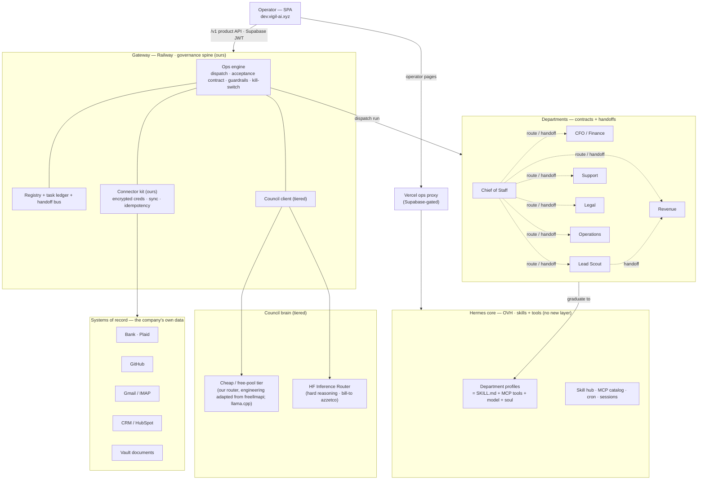
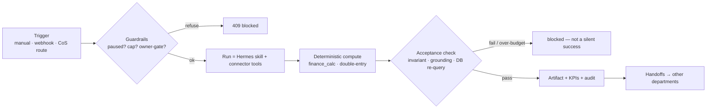

# Agentic Company — Master Plan

Status: **living plan**. Last updated 2026-06-22. Supersedes the direction in
`plans/ops-team-agentic-company.md` (which remains the P0–P2 build record).

A company of department agents running **inside the Hermes project we built** —
governed by our own thin spine, powered by Hermes-core skills + tools, and grown by
**adapting open-source engineering into our own code**, never by depending on it.

---

## 0. Governing principles (the constraints, in priority order)

1. **Add to Hermes core, don't build another layer.** Capability lives as Hermes
   **skills** (`SKILL.md`) + **MCP tools** + our **gateway compute**. We do not adopt a
   second agent framework/runtime (AutoGen, MetaGPT, CrewAI, n8n-as-a-service, …).
2. **Mimic the engineering — no vendor/client relationship with a repo.** We clone a
   source only to *read* it, then **reimplement/adapt** the engineering in our stack.
   We never run someone's app/agent/proxy and depend on it at runtime.
3. **Keep the governance spine.** The one thing no OSS agent has: deterministic
   **acceptance**, multi-tenant **scoping**, the **owner gate**, the **handoff ledger**,
   the **kill switch**. That stays in our gateway. Capability moves to skills/tools;
   the spine dispatches and grades them.
4. **Numbers are computed, not guessed.** Where math matters (finance), compute it
   deterministically; the model only narrates. Acceptance = an arithmetic invariant.
5. **System-of-record access is fine; 3rd-party agents are not.** Reaching the
   company's own data (bank, GitHub, inbox) via *our own* connector is necessary.
   Depending on an experimental agent/proxy repo is the thing we avoid.

---

## 1. How the ecosystem works inside Hermes

### The governed run loop (every department run)

---

## 2. Departments (the roster)

| Dept | Head | Jobs | Acceptance (what "worked" means) | System of record |
|---|---|---|---|---|
| **Finance** (CFO) | cfo_review | reconcile · report | category sums reconcile to net; txns categorised | Bank (Plaid) → ledger |
| **Revenue** | cro | follow_up | a draft per stalled deal (review-then-send) | CRM |
| **Lead Scout** | cro | scout | leads created + qualified, handed to Revenue | inbox → CRM |
| **Support** | comms | triage | every msg triaged w/ valid category; drafts for `respond` | Mail |
| **Legal** | legal_review | review | cites **real** Vault docs (grounded) | Vault docs |
| **Operations** | coo | digest | digest counts re-reconcile (deterministic) | commitments · tasks |
| **Chief of Staff** | cos | route · brief | dispatched N departments / brief compiled | all (orchestrates) |

Each is an effectiveness contract: **job · input · tools · output · acceptance · budget**.
A department is "live" only after its `selftest` passes.

---

## 3. Capability layers (where each piece lives)

- **Brain — council (tiered):** cheap/free-pool tier for high-volume classification
  (our router, engineering adapted from freellmapi; or self-hosted llama.cpp) →
  near-zero cost; HF router for hard reasoning. Selected per call via `cheap_worker()`.
- **Skills — Hermes `SKILL.md`:** the department SOPs, authored by us, adapting prompt
  engineering from cfo-stack / lavern / OneWave / SDR repos.
- **Tools — connector kit (ours):** encrypted per-user creds + sync + idempotency,
  generalised from the Plaid connector. One thin adapter per system of record.
- **Compute — deterministic modules:** `finance_calc` (DCF/VaR/Benford/variance,
  clean-room from CFO-Toolkit), double-entry, report invariants.
- **Spine — gateway:** dispatch, acceptance, guardrails, owner gate, handoff ledger,
  kill switch, multi-tenant scoping.

---

## 4. Open-source harvest map (both lists, under the rules)

We **read → reimplement/adapt**; nothing becomes a runtime dependency.

| Source | License | Engineering we lift | Lands in our repo as |
|---|---|---|---|
| `freellmapi` | MIT | provider-adapter + rate-limit ledger + failover + wire-translation | free-pool router in `providers.py` |
| `MikeChongCan/cfo-stack` | MIT | C.L.E.A.R. SOP, 27-skill split, double-entry, reconcile, tax | Finance `SKILL.md` + finance compute |
| `CFO-Automation-Toolkit` | unspecified | DCF · Monte-Carlo · VaR · Benford fraud · variance | clean-room `finance_calc.py` |
| `AnttiHero/lavern` | Apache-2.0 | doc parser · citation grounding · multi-pass verify · precedent board | Legal tool + `SKILL.md` |
| `OneWave-AI/claude-skills` | MIT | 172 ready skills (sales/marketing/CS/eng) | adapted `SKILL.md`s |
| SDR / Sales-Outreach / YALC / AI-Sales | mixed | research→qualify→personalize sequences, enrichment | Sales/Scout `SKILL.md` |
| `autogen` / `MetaGPT` | MIT | role-SOP, consensus/termination ("Code = SOP(Team)") | pattern → contract + handoff spine |
| `llama.cpp` | MIT | self-hosted inference | cheap-tier engine (infra we run, not a vendor) |

**Explicitly OUT (violate the rules):**
- **GitHub Copilot** — proprietary (nothing to adapt) + pure vendor-client. CTO/Eng
  mimics it via council + our GitHub connector + an eng skill.
- **n8n (as a service/bus)** — running + triggering it = vendor + second layer.
  *Reversed from an earlier recommendation.* Connectors are built in our kit instead.
- **EspoCRM / NocoBase / Krayin (as backends)** — hosted apps = layer+vendor. Keep our
  `crm_*` tables; mimic useful patterns only.
- **Temporal / CrewAI / LangChain** — frameworks/runtimes = another layer. Mimic
  patterns; we already have engine + handoffs + direct provider calls.
- **MailAgent / InboxZeroAI** — do not exist (404).

---

## 5. Build plan (phased)

- **Phase 0 — Connector kit.** Generalise the Plaid connector (encrypted creds · sync ·
  idempotency · status/keys) into a reusable base so GitHub / Gmail / HubSpot are each a
  thin adapter we own. *(Replaces the n8n idea.)*
- **Phase 1 — Free-pool inference router.** Adapt freellmapi's engineering into
  `providers.py` (multi free-tier providers + rate-limit ledger + failover) behind the
  cheap-tier. Our keys, our code.
- **Phase 2 — Finance deep skill + exact math.** `finance_calc.py` (clean-room) +
  double-entry + P&L/BS/CF, fronted by a Finance `SKILL.md` adapting cfo-stack's SOP.
- **Phase 3 — Legal grounded verification.** Adapt lavern's doc-parser + multi-pass
  verification + precedent board into our Legal tool/skill.
- **Phase 4 — Sales / Marketing / Support / Eng skills.** Authored `SKILL.md`s adapting
  OneWave + SDR engineering.
- **Phase 5 — SOP rigor.** Fold MetaGPT/AutoGen role-SOP + consensus/termination into the
  department contracts + handoffs.
- **Phase 6 — Graduate departments to Hermes profiles.** Each department = a Hermes
  profile (our skills + our MCP tools + model + soul); the gateway `run_job` dispatches
  the profile via the ops proxy instead of a bespoke handler. Acceptance / handoff /
  owner-gate stay in the gateway. **This is the migration off bespoke handlers.**

---

## 6. Status — what exists vs. to build

**Shipped (deployed, tested — 41 gateway tests green):**
- Ops engine + 7 departments (handlers) with acceptance contracts, handoffs, guardrails,
  kill switch; the board (`OpsTeamPage`) with per-job runs + health.
- Plaid bank connector + encrypted keys store + keys-editable-from-UI (migrations
  017/018/019 applied to prod `vgl`).
- Cheap-tier seam (`local` family + `cheap_worker()`, env-gated).
- Council (HF router, bill-to azzetco; primary/reviewers/chairman).

**To build:** Phases 0–6 above (connector kit → free-pool router → finance/legal/sales
skills+compute → SOP rigor → graduate to Hermes profiles).

---

## 7. Licensing & attribution
MIT/Apache sources (freellmapi, cfo-stack, lavern, OneWave, llama.cpp, autogen, MetaGPT)
→ adapt with a `NOTICE` attribution. Unspecified/AGPL sources (CFO-Toolkit, the AGPL
sales inboxes) → **clean-room reimplement from behaviour only**, no code copied.

## 8. Risks / open decisions
- **Free-tier ToS** (Phase 1): free LLM tiers have usage limits + ToS; keep them for
  internal classification, not customer-facing volume; fail over to HF.
- **OVH capacity** when departments graduate to profiles — cap concurrency + keep the
  per-run budget; on-demand only (no clock schedules).
- **Decision:** Phase 6 graduation means retiring the bespoke handlers. Confirm before
  migrating each department (handlers stay as the fallback until its profile selftest is green).
