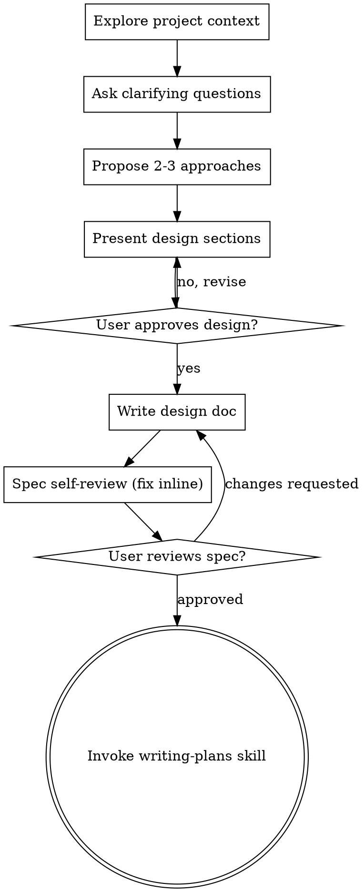

# Brainstorming Ideas Into Designs

Help turn ideas into fully formed designs and specs through natural collaborative dialogue.

Start by understanding the current project context, then ask questions one at a time to refine the idea. Once you understand what you're building, present the design and get user approval.

<HARD-GATE>
Do NOT invoke any implementation skill, write any code, scaffold any project, or take any implementation action until you have presented a design and the user has approved it. This applies to EVERY task regardless of perceived simplicity.
</HARD-GATE>

## Anti-Pattern: "This Is Too Simple To Need A Design"

Every project goes through this process. A todo list, a single-function utility, a config change — all of them. "Simple" projects are where unexamined assumptions cause the most wasted work. The design can be short (a few sentences for truly simple projects), but you MUST present it and get approval.

## Checklist

You MUST create a task for each of these items and complete them in order:

1. **Explore project context** — check files, docs, recent commits
2. **Ask clarifying questions** — one at a time, understand purpose / constraints / success criteria
3. **Propose 2-3 approaches** — with trade-offs and your recommendation
4. **Present design** — in sections scaled to their complexity, get user approval after each section
5. **Write design doc** — save to `docs/specs/YYYY-MM-DD-<topic>-design.md` and commit
6. **Spec self-review** — quick inline check for placeholders, contradictions, ambiguity, scope
7. **User reviews written spec** — ask the user to review the spec file before proceeding
8. **Transition to implementation** — invoke the writing-plans skill to create the implementation plan

## Process Flow

**The terminal state is invoking writing-plans.** The ONLY skill you invoke after brainstorming is writing-plans.

## The Process

**Understanding the idea:**
- Check the current project state first (files, docs, recent commits).
- Before detailed questions, assess scope: if the request describes multiple independent subsystems (e.g. "build a platform with chat, file storage, billing, and analytics"), flag it immediately. Don't refine details of a project that needs decomposition first.
- If too large for a single spec, help the user decompose into sub-projects: the independent pieces, how they relate, what order to build. Then brainstorm the first sub-project through the normal flow. Each sub-project gets its own spec → plan → implementation cycle.
- For appropriately-scoped projects, ask questions one at a time.
- Prefer multiple-choice questions when possible; open-ended is fine too.
- Only one question per message.
- Focus on purpose, constraints, success criteria.

**Exploring approaches:**
- Propose 2-3 approaches with trade-offs.
- Lead with your recommended option and explain why.

**Presenting the design:**
- Once you understand what you're building, present the design.
- Scale each section to its complexity: a few sentences if straightforward, up to 200-300 words if nuanced.
- Ask after each section whether it looks right.
- Cover: architecture, components, data flow, error handling, testing.

**Design for isolation and clarity:**
- Break the system into smaller units that each have one clear purpose, communicate through well-defined interfaces, and can be understood and tested independently.
- For each unit: what does it do, how do you use it, what does it depend on?
- Smaller, well-bounded units are easier to reason about and edit reliably. A file growing large is often a signal it's doing too much.

**Working in existing codebases:**
- Explore the current structure before proposing changes. Follow existing patterns.
- Where existing code has problems that affect the work, include targeted improvements as part of the design.
- Don't propose unrelated refactoring. Stay focused on the current goal.

## After the Design

**Documentation:**
- Write the validated design (spec) to `docs/specs/YYYY-MM-DD-<topic>-design.md` (user preferences override this default).
- Commit the design document to git.

**Spec Self-Review** — look at it with fresh eyes:
1. **Placeholder scan:** any "TBD"/"TODO"/vague requirements? Fix them.
2. **Internal consistency:** do sections contradict? Does the architecture match the features?
3. **Scope check:** focused enough for one implementation plan, or does it need decomposition?
4. **Ambiguity check:** could a requirement be read two ways? Pick one and make it explicit.

Fix issues inline. No need to re-review — fix and move on.

**User Review Gate:**
> "Spec written and committed to `<path>`. Please review it and let me know if you want changes before we start the implementation plan."

Wait for the response. If they request changes, make them and re-run the spec review. Only proceed once the user approves.

**Implementation:**
- Invoke the writing-plans skill to create a detailed implementation plan. Do NOT invoke any other skill.

## Key Principles
- **One question at a time** — don't overwhelm.
- **Multiple choice preferred** — easier to answer.
- **YAGNI ruthlessly** — remove unnecessary features.
- **Explore alternatives** — always propose 2-3 approaches before settling.
- **Incremental validation** — present design, get approval before moving on.
- **Be flexible** — go back and clarify when something doesn't make sense.

## Visual companion (optional)
When upcoming questions are genuinely visual (mockups, layouts, diagrams), you may render them with whatever visual/canvas tool the host exposes — offer it once, as its own message, and decide per-question whether a visual beats text. A UI *topic* is not automatically a visual *question*: "what does personality mean here?" is conceptual (use text); "which layout works better?" is visual.
